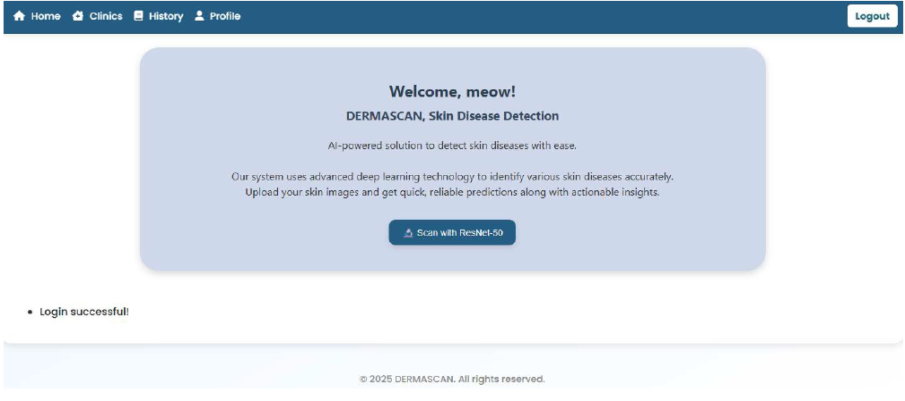
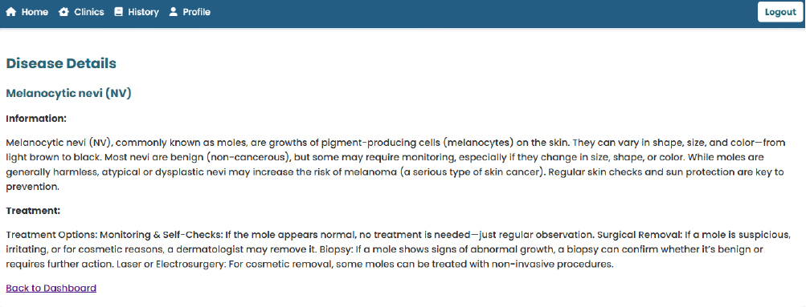
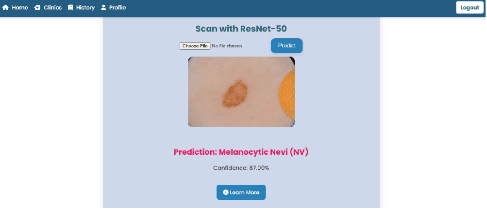
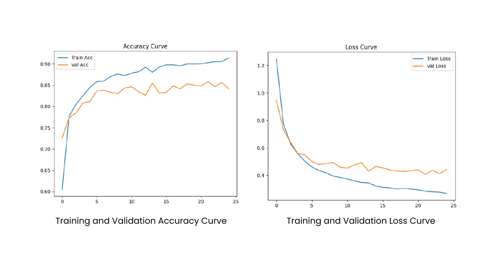

# DermaScan
Skin Disease Detection Using ResNet

Overview

Derma Scan is a web-based skin analysis system designed to help users understand their skin condition and receive suitable skincare recommendations.

The system analyzes user input related to skin characteristics such as oiliness, acne, dryness, and sensitivity. Based on the responses, the system identifies the user's skin condition and suggests appropriate skincare guidance.

This platform aims to assist users in gaining basic insights about their skin health and making more informed skincare decisions.

Key Features

User Module:

-Input skin condition information

-Complete a skin assessment questionnaire

-Receive skin analysis results

-View skincare recommendations

System Features

-Skin condition classification

-Personalized skincare suggestions

-Simple and user-friendly interface

-Data processing and result generation

Technologies Used

Component	: Technology

Frontend	: HTML, CSS, JavaScript

Backend	: PHP

Database	: MySQL

System Workflow

-User enters skin-related information.

-The system processes the input data.

-Skin condition is analyzed based on predefined rules.

-The system generates skin analysis results.

-Suitable skincare recommendations are displayed to the user.

Installation Guide

1. Clone the Repository
   
3. git clone https://github.com/ZersssR/DermaScan.git
   
5. Move Project to Local Server

Place the project folder inside your local server directory.

Example:

XAMPP

htdocs/dermascan

Laragon

www/dermascan

3. Import Database

Open phpMyAdmin

-Create a new database (example: skindisease)

-Import the provided SQL file

4. Run the System

-Start your local server and open:

-http://localhost/dermascan

Future Improvements

-Integrate AI-based skin analysis

-Add image-based skin detection

-Improve skincare recommendation accuracy

-Develop a mobile-friendly responsive interface

Screenshots

Author

Syu

Bachelor of Computer Science (Software Development)
